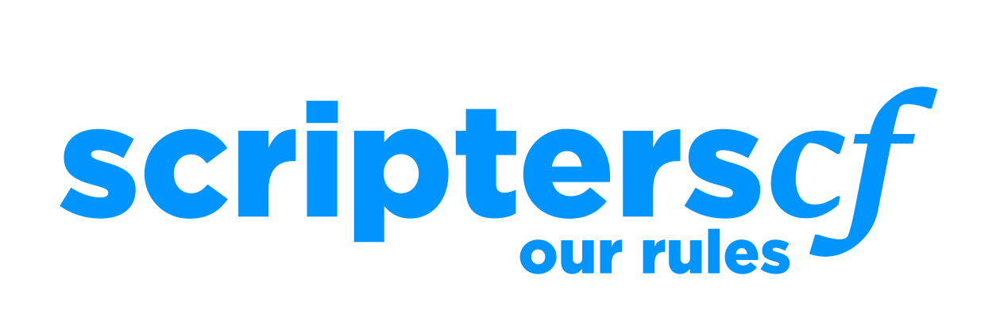

_______________
- **You must be 13+** - *This is a legal requirement*
- **Be friendly; treat everyone with respect** - *We're all equals here!*
__________
- **No NSFW, racial or excessive inappropriate talk** - *If you're unsure, just don't post it*
- **No participating in raids** - *Includes raiding other servers*
- **No spamming** - *Includes both repeated & low-qualitmessages*
- **No filter bypassing** - *It's there for a reason*
- **No selfbots/userbots** - *You may only use real Discord bots for this*
- **No exploits** - *You may only discuss exploits in favour of your own game's security*
- **No advertising** - *Purchase ad slots via #contact-us*
- **No shortened links** - *Includes IP grabbers & malicious links*
- **No executable files** - *We want to protect you. Please request permission first*
_______________
- **No discussing mod actions** - *Mistakes can happen, but please use #contact-us*
- **No accusing scammers publicly** - *There's two sides to every story. Please #contact-us and we can help*
- **No trading outside the proper channels** - *We want to protect our community from scams*
___________
- **Please avoid political discussion**
    - *Everyone has different beliefs based on their own personal experiences.*
    - *Please respect that and help us avoid a toxic environment*
____________
- **You are responsible for your own account** - *If your brother breaks a rule, that is your fault*
- **Use common sense** - *These rules are just guidelines. You know right from wrong*
___________
By staying in the server, you are giving us explicit permission to store information including messages, message count, moderation history and anything else that we deem appropriate.

This allows us to moderate effectively or implement certain bot functions, contains no personally identifable information and will not be shared with or sold to any external parties.
